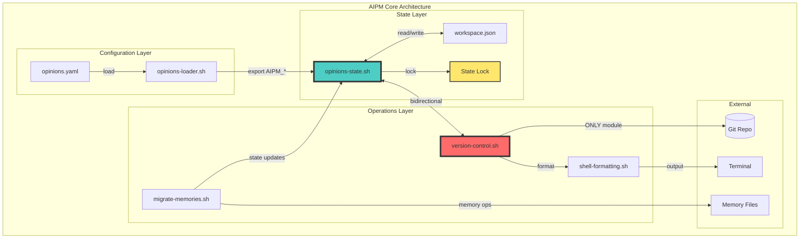
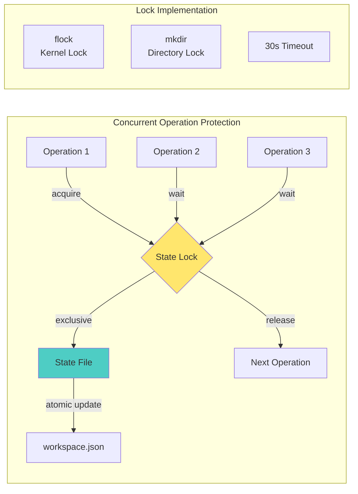
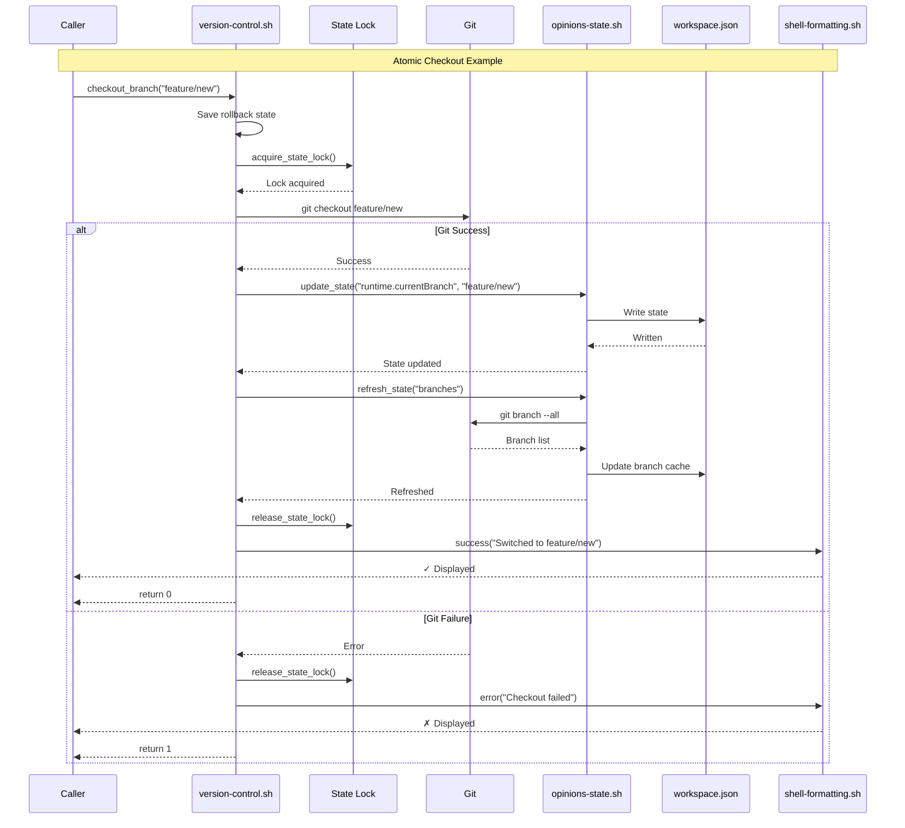
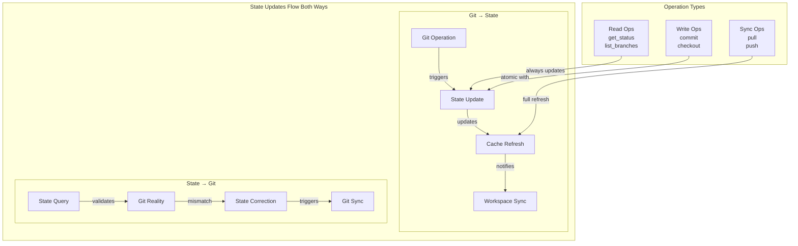
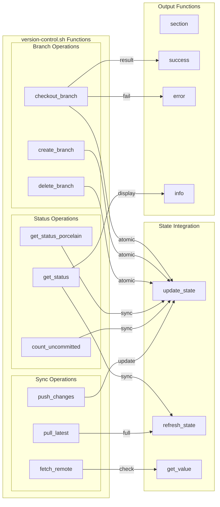
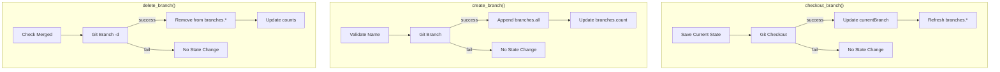
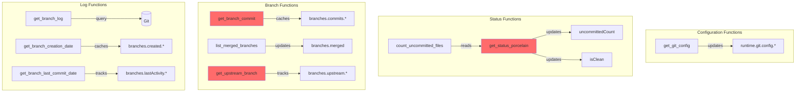
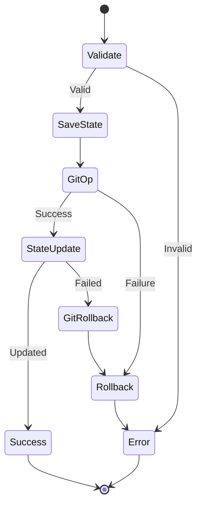
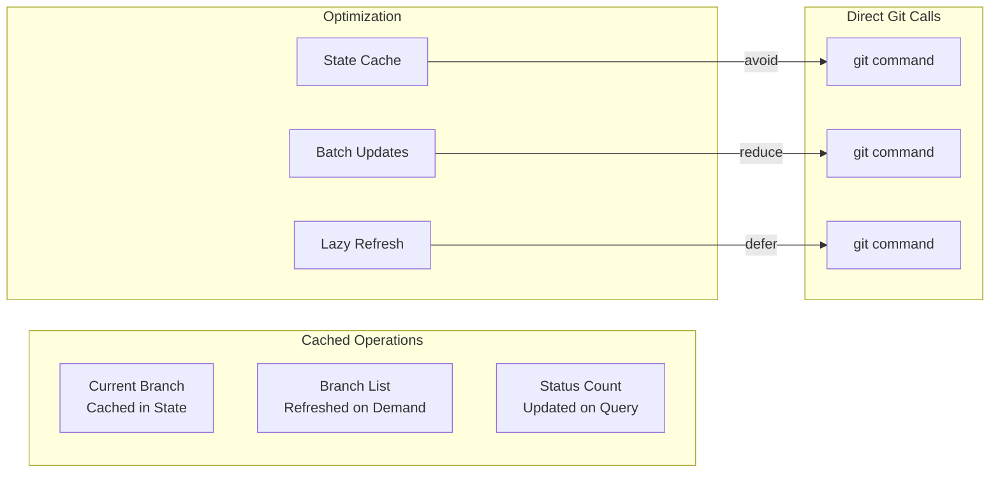

# Version Control Architecture

## Overview

`version-control.sh` is the **single gateway** for all git operations in AIPM, ensuring atomic state management through bidirectional integration with `opinions-state.sh`.

## Architecture Principles

```
1. Single Source of Truth: ONLY version-control.sh calls git
2. Atomic Operations: Git + State succeed or fail together  
3. Bidirectional Sync: Git operations ↔ State updates
4. Formatted Output: All output through shell-formatting.sh
```

## System Architecture



## Lock Management Architecture



## Atomic Operation Flow



## State Integration Architecture



## Module Integration Points



## Critical Functions & State Updates

### Branch Operations


### State Synchronization Points

| Operation | State Path | Update Type | Lock Required |
|-----------|------------|-------------|---------------|
| checkout | runtime.currentBranch | Direct | Yes |
| branch --all | runtime.branches.all | Full Replace | Yes |
| status | runtime.git.uncommittedCount | Direct | Yes |
| commit | runtime.git.uncommittedCount<br>runtime.git.lastCommit | Multiple | Yes |
| fetch | runtime.git.hasNewRemote | Check | Yes |
| pull | runtime.branches.*<br>runtime.git.ahead/behind | Refresh | Yes |
| push | runtime.lastSync | Timestamp | Yes |

## Function Implementation Pattern

```bash
# Every function MUST follow this pattern
function_name() {
    local param="$1"
    
    # 1. Pre-operation state
    local rollback_state=$(get_current_state)
    
    # 2. Acquire lock for atomic operation
    acquire_state_lock
    
    # 3. Git operation
    if git command "$param"; then
        # 4. State update (atomic with git)
        update_state "state.path" "new_value"
        release_state_lock
        
        # 5. Success output
        success "Operation completed"
        return 0
    else
        # 6. No state change on git failure
        release_state_lock
        error "Operation failed"
        return 1
    fi
}
```

## Missing Functions Architecture



## Error Handling & Rollback



## Performance Considerations



## Summary

This architecture ensures:
1. **No git calls outside version-control.sh**
2. **Every git operation atomically updates state**
3. **Locks prevent concurrent state corruption**
4. **All output properly formatted**
5. **Rollback possible for failed operations**

The bidirectional integration between `version-control.sh` and `opinions-state.sh` eliminates state desync by design.