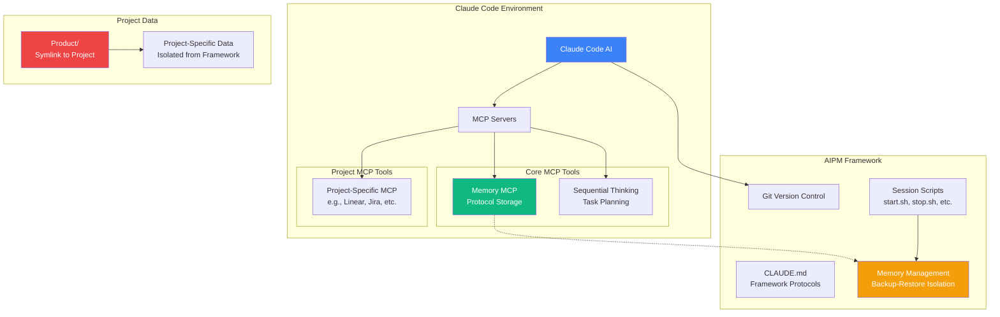
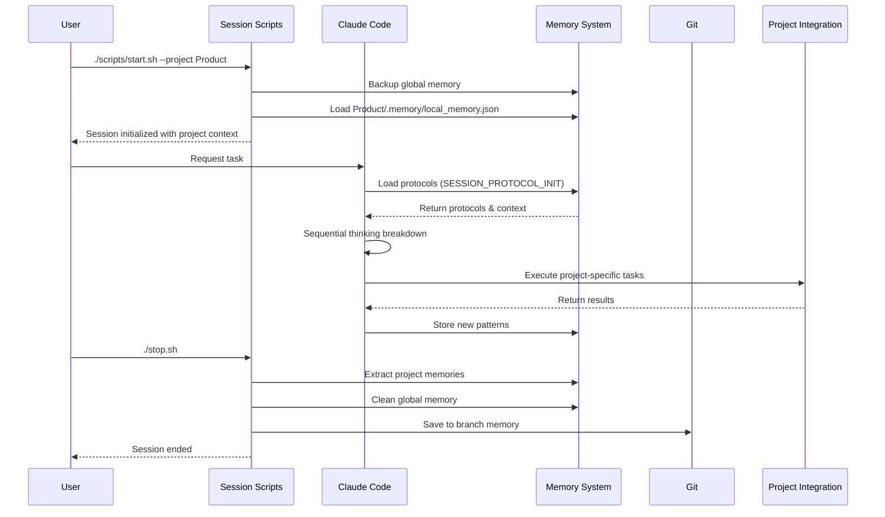

# AIPM - AI Project Manager Framework

> **Context**: This is the comprehensive framework documentation. For quick start, see README.md. For product usage, see `./Product/`

## 🤖 Protocol-Driven AI Project Management Framework

### Executive Summary

AIPM (AI Project Manager) is a **protocol-driven framework** for AI-assisted project management using Claude Code. It provides a reusable architecture that enables structured, repeatable project execution with mandatory protocol compliance, memory isolation, and clean separation between framework code and project data.

**Key Value:** Transform any project management system into an AI-orchestrated workflow with full version control, protocol enforcement, and persistent memory across sessions.

---

## 🏗️ System Architecture



---

## 🔄 Session Management Workflow



---

## 🎯 Purpose & Benefits

### For Executives
- **Framework Reusability**: One framework supports unlimited project types
- **Version Control**: Complete audit trail of AI decisions and knowledge
- **Protocol Compliance**: Guaranteed consistent AI behavior
- **Time Savings**: Structured approach reduces setup time by 90%

### For Developers
- **Protocol-Driven**: Self-enforcing development standards
- **Memory Isolation**: Clean separation between projects
- **Extensible**: Add new protocols and integrations easily
- **Self-Documenting**: Framework explains its own operations

---

## 🚦 How It Works

### 1. **Protocol Enforcement**
Every Claude Code session begins by loading protocols from memory:
```
SESSION_PROTOCOL_INIT → Load all protocols
SESSION_PROTOCOL_SEQUENTIAL → Plan with sequential thinking
SESSION_PROTOCOL_MEMORY → Store discoveries
GUARDRAIL_PROTOCOL_COMPLIANCE → Enforce standards
```

### 2. **Memory Management**
```
Branch-Specific Memory ←→ Global Memory (Session Only)
         ↓                        ↓
    Git Version Control      Runtime State
```

### 3. **Multi-Project Architecture**

```
AIPM/                          # Framework root
├── scripts/                   # All operations from here
│   └── [start|stop|save].sh --project [NAME]
│
├── Product/                   # Project 1 (symlinked)
│   ├── .memory/              # Project's AI memory
│   ├── data/                 # Project data
│   └── [standard structure]  # CLAUDE.md, README.md, etc.
│
└── [ProjectName]/            # Future projects
    └── [identical structure] # Same organization
```

**Key Features:**
- Each project is a separate git repository
- Projects maintain their own `.memory/local_memory.json`
- All scripts run from AIPM root with `--project NAME`
- Framework remains project-agnostic
- Scales to unlimited projects

---

## 🔐 Security & Memory Isolation

### ⚠️ **CRITICAL: Memory Isolation Challenge**

The memory.json system has a fundamental limitation:
```bash
# All projects share this global location:
~/.npm/_npx/*/node_modules/@modelcontextprotocol/server-memory/dist/memory.json
```

**Security Implications:**
1. **Cross-Project Contamination**: Different projects share memory
2. **No Branch Isolation**: Memory persists across git branches
3. **Multi-User Conflicts**: Shared environments have shared memory

**Solution: Backup-Restore Memory Isolation**
```bash
./scripts/start.sh --project Product  # Backup global, load project memory
# ... work in Claude Code ...
./scripts/stop.sh --project Product   # Save changes, restore backup
./scripts/save.sh --project Product "commit message"  # Version control
```

See `AIPM_Design_Docs/memory-management.md` for complete details.

---

## 🚀 Getting Started

### Prerequisites
- Claude Code installed
- Git repository initialized
- Project-specific MCP servers configured

### Framework Setup
1. **Clone the AIPM framework**
   ```bash
   git clone [repository-url]
   cd AIPM
   ```

2. **Configure MCP servers**
   ```bash
   # Required for all projects
   claude mcp add sequential-thinking npx -- -y @modelcontextprotocol/server-sequential-thinking
   claude mcp add memory npx -- -y @modelcontextprotocol/server-memory
   
   # Add project-specific servers
   claude mcp add [project-server] [command]
   ```

3. **Create project symlink**
   ```bash
   ln -s /path/to/your/project Product
   ```

4. **Start a session**
   ```bash
   ./scripts/start.sh
   ```

5. **Initialize Claude Code**
   ```
   Read and follow CLAUDE.md and tell me where we are
   ```

6. **End session properly**
   ```bash
   ./scripts/stop.sh
   ./scripts/save.sh "Description of session work"
   ```

---

## 📚 Version Control Benefits

### Memory Evolution Tracking
```bash
# View framework memory changes
git log --oneline -- .memory/local_memory.json

# View project memory changes
git log --oneline -- Product/.memory/local_memory.json

# Compare memory between branches
git diff main feature-branch -- .memory/local_memory.json

# Revert to previous memory state
./scripts/revert.sh --framework [commit-hash]
./scripts/revert.sh --project Product [commit-hash]
```

### Why This Matters
1. **Knowledge History**: AI learning is versioned
2. **Rollback Capability**: Undo problematic patterns
3. **Branch Isolation**: Different features have different memories
4. **Team Collaboration**: Share AI knowledge through git

---

## 🎯 Core Components

| Component | Purpose | Location |
|-----------|---------|----------|
| CLAUDE.md | Framework protocols and usage | `/CLAUDE.md` |
| Memory System | Project-isolated AI state | `.memory/local_memory.json` |
| Session Scripts | Memory management | `./scripts/start.sh`, `./scripts/stop.sh`, etc. |
| Current Focus | Active framework tasks | `/current-focus.md` |
| Design Docs | Architecture documentation | `/AIPM_Design_Docs/` |
| Project Data | Symlinked project files | `/Product/` (excluded from git) |

---

## ⚡ Session Management Scripts

### start.sh - Begin Work Session
```bash
# Framework work
./scripts/start.sh --framework

# Project work
./scripts/start.sh --project Product

# What it does:
# - Backs up global memory to .memory/backup.json
# - Loads context-specific memory (framework or project)
# - Creates session metadata
# - Ensures complete isolation between contexts
```

### stop.sh - End Work Session
```bash
# Must match start.sh context
./scripts/stop.sh --framework
./scripts/stop.sh --project Product

# What it does:
# - Saves changes to context-specific local_memory.json
# - Restores original global memory from backup
# - Cleans up temporary files
# - Shows session statistics
```

### save.sh - Commit Memory Changes
```bash
./scripts/save.sh --framework "Update memory architecture"
./scripts/save.sh --project Product "Fixed deployment workflow"

# What it does:
# - Commits context-specific local_memory.json to git
# - Includes memory statistics in commit message
# - Maintains audit trail of AI knowledge evolution
```

### revert.sh - Time Travel Memory
```bash
./scripts/revert.sh
# - Interactive selection of previous state
# - Backs up current memory
# - Restores selected version
```

---

## 🚧 Known Limitations & Solutions

1. **Memory Package Bug**: The npm package ignores MEMORY_FILE_PATH
   - **Solution**: Backup-restore mechanism provides complete isolation
2. **Manual Session Management**: Must run scripts explicitly
   - **By Design**: Ensures conscious context switching
3. **Naming Discipline**: All entities need project prefixes
   - **Enforced**: AIPM_ for framework, PROJECT_ for projects
4. ~~**Global Memory Visibility**: Other projects' data is readable~~
   - **Solved**: Backup-restore ensures complete isolation
5. **Concurrent Sessions**: Multiple users need coordination
   - **Managed**: Single backup location prevents conflicts

---

## 📊 Success Metrics

- ✅ Protocols loaded at every session start
- ✅ Sequential thinking for all tasks
- ✅ Memory isolated per branch
- ✅ Clean framework/project separation
- ✅ Version-controlled AI knowledge

---

## 🔧 Troubleshooting

### Memory Not Persisting?
```bash
# Check if session was properly ended
./scripts/stop.sh

# Verify branch memory exists
ls -la .claude/memory/[branch-name].json
```

### MCP Tools Not Available?
```bash
# Check MCP configuration
cat .claude/settings.local.json

# Restart Claude Code after config changes
```

### Session Scripts Not Found?
```bash
# Make scripts executable
chmod +x scripts/*.sh

# Always run from AIPM root directory
./scripts/start.sh --framework
# NOT: cd scripts && ./start.sh
```

---

## 🔮 Future Enhancements

### In Development
- Session management scripts implementation
- Memory visualization tools
- Protocol validation utilities
- Project scaffolding templates

### Planned
- Git hooks for automatic session management
- VS Code extension integration
- Custom MCP server with native project isolation
- Auto-detection of available projects
- Cross-project memory insights (with permission)

---

## 📝 License & Support

Copyright 2025 AION ([AION.xyz](https://AION.xyz))

Created by Harsh Joshi ([getharsh.in](https://getharsh.in))

Licensed under the Apache License, Version 2.0

For support and documentation, see:
- CLAUDE.md - Usage protocols
- AIPM_Design_Docs/ - Architecture details
- current-focus.md - Development status

---

*Built with Claude Code + MCP + Protocol-Driven Development*