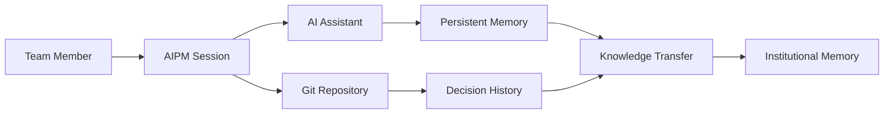
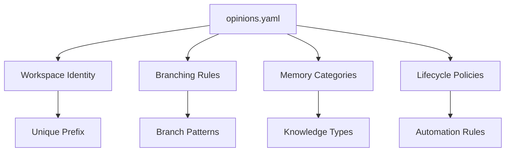
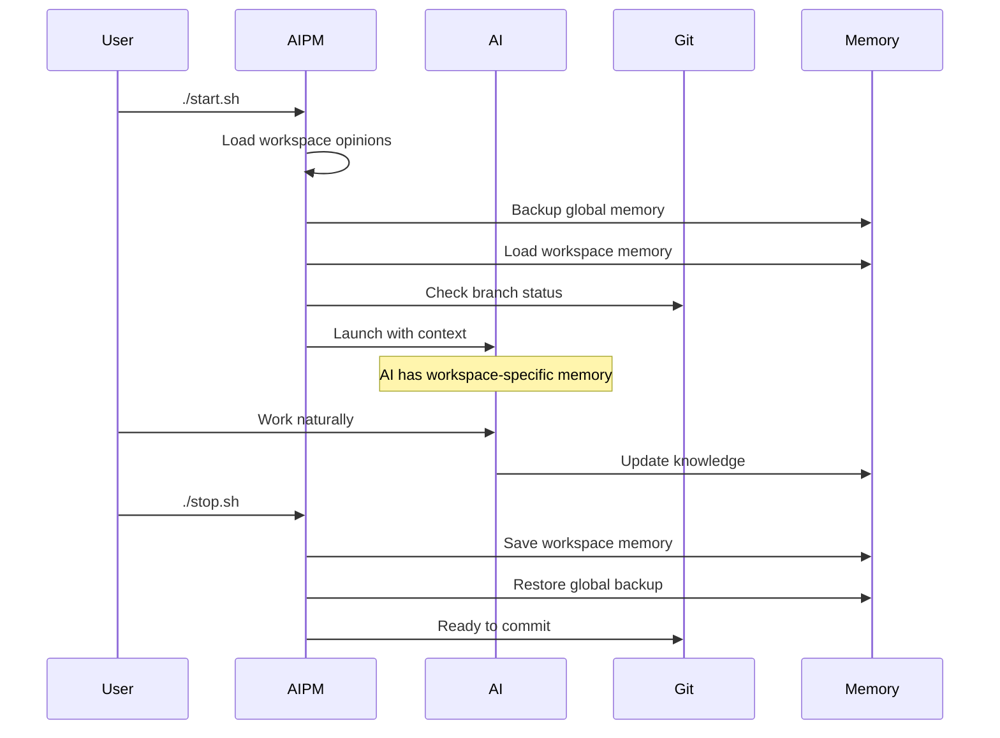
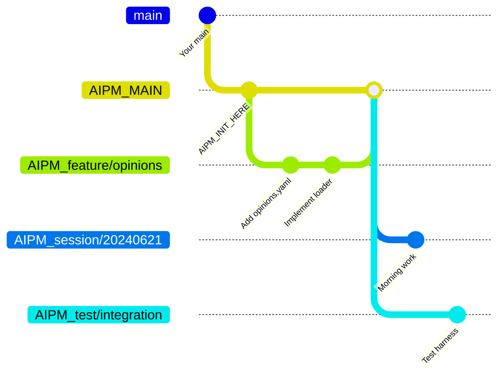
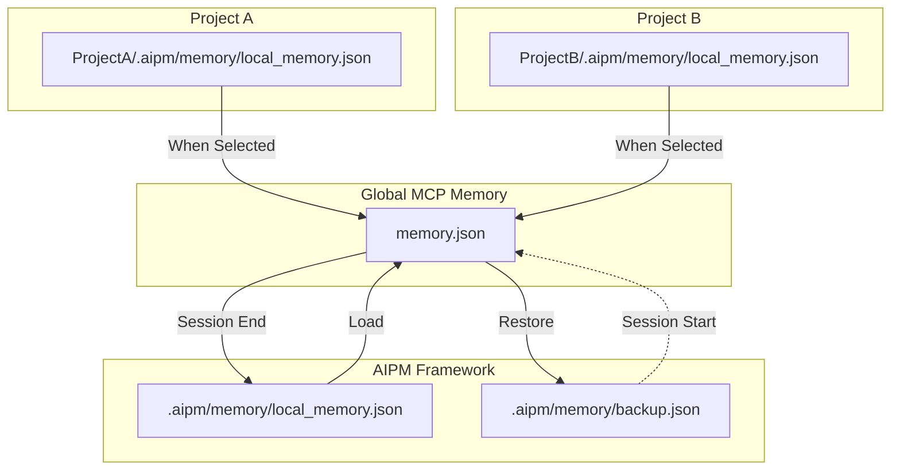
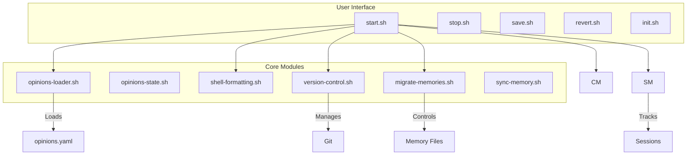
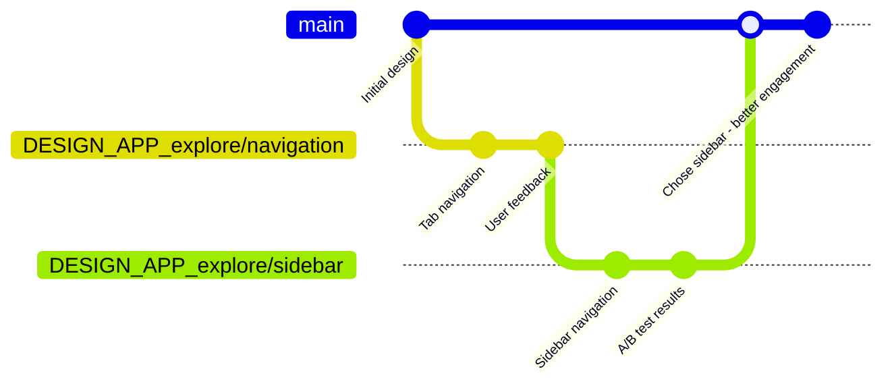
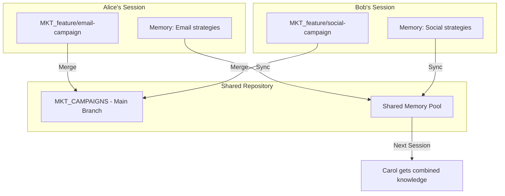

# AIPM - AI Project Manager Framework

**A gentle introduction to the architecture that transforms how teams track decisions**

> **Quick Start**: [README.md](./README.md) | **AI Rules**: [.agentrules](./.agentrules) | **Technical Docs**: [.aipm/docs/](./.aipm/docs/)

## What AIPM Is

AIPM brings git's superpowers to every team - not just developers. It creates isolated workspaces where AI assistants maintain persistent memory, teams work without conflicts, and every decision is tracked with full context.



## The Core Innovation: Opinions Drive Everything

Every workspace has an `.aipm/opinions.yaml` file that defines how that specific team works:



This simple file enables complete workspace isolation and customization. Marketing teams use marketing terminology. Engineers use engineering patterns. Each team works naturally while AIPM handles the complexity.

## How Sessions Work

When you start an AIPM session, a carefully orchestrated process ensures perfect isolation:



## The Branching Architecture

AIPM creates a parallel universe of branches for each workspace:



Your original branches remain untouched. AIPM branches are clearly namespaced and managed according to lifecycle rules.

## Memory Isolation

The memory system ensures complete isolation between workspaces:



Each workspace maintains its own memory file, versioned in git. The global memory is just a runtime container.

## The Module Architecture

AIPM is built on six core modules that work together:



### opinions-loader.sh - The Cornerstone

This module makes AIPM truly workspace-aware:

```bash
# Detects current workspace context
load_workspace_opinions "framework" ""
load_workspace_opinions "project" "Marketing"

# Provides workspace-specific values
get_workspace_prefix()      # Returns "AIPM_" or "MKT_"
get_main_branch()          # Returns "AIPM_MAIN" or "MKT_CAMPAIGNS"
enforce_branch_operation() # Ensures compliance with rules
```

### shell-formatting.sh - Consistent Experience

Handles all output and platform differences:

```bash
# Beautiful, consistent output
info "Starting session..."
success "✓ Memory loaded"
warn "⚠ Uncommitted changes"
error "✗ Operation failed"

# Platform detection
detect_platform()          # macOS, Linux, WSL
detect_execution_context() # Terminal, CI, Claude
```

### version-control.sh - Git Operations

**⚠️ Critical Architecture Rule**: Only version-control.sh may call git commands directly. All other modules MUST use its functions. This ensures consistent state management and prevents desynchronization.

All git operations flow through this module:

```bash
# Branch operations respect workspace opinions
create_branch "feature/new-thing"  # Creates "PREFIX_feature/new-thing"
switch_branch "AIPM_MAIN"         # Safe switching with stash

# The Golden Rule - always stage everything
stage_all_changes()
commit_with_stats "Implement new feature"
```

### migrate-memories.sh - Memory Operations

Handles all memory file operations atomically:

```bash
# Atomic operations prevent corruption
backup_memory "$GLOBAL" "$BACKUP"
merge_memories "$LOCAL" "$REMOTE" "$OUTPUT"
validate_memory_stream "$FILE"     # Ensures proper prefixes
```

### config-manager.sh - Central Configuration

All paths and defaults in one place:

```bash
get_memory_path "framework"        # Returns correct path
get_session_timeout()             # Configurable timeout
get_merge_strategy()              # User preference
```

### session-manager.sh - Session Lifecycle

Tracks active sessions and metadata:

```bash
create_session "project" "Marketing"
detect_active_session()
cleanup_stale_sessions()
calculate_session_duration()
```

## Real-World Workspace Examples

### Marketing Team

```yaml
# Marketing/.aipm/opinions.yaml
workspace:
  type: project
  name: MARKETING_Q1_2025
  
branching:
  prefix: MKT25Q1_
  mainBranchSuffix: CAMPAIGNS
  
naming:
  campaign: "campaign/{name}"
  creative: "creative/{campaign}/{version}"
  analysis: "analysis/{metric}/{date}"
  
memory:
  entityPrefix: MKT25Q1_
  categories:
    - CAMPAIGN_BRIEF
    - TARGET_AUDIENCE  
    - CREATIVE_ASSETS
    - PERFORMANCE_METRICS
    - LESSONS_LEARNED
```

### Product Design Team

```yaml
# Design/.aipm/opinions.yaml
workspace:
  type: project
  name: MOBILE_APP_REDESIGN
  
branching:
  prefix: DESIGN_APP_
  mainBranchSuffix: MAIN
  
naming:
  exploration: "explore/{concept}"
  iteration: "iteration/{version}"
  usability: "test/{user-group}"
  handoff: "handoff/{sprint}"
  
memory:
  entityPrefix: DESIGN_APP_
  categories:
    - USER_RESEARCH
    - DESIGN_PRINCIPLES
    - COMPONENT_SPECS
    - ACCESSIBILITY
    - DEVELOPER_HANDOFF
```

## The Power of Git for Non-Code

When design decisions are tracked in git:



The team can always answer "Why did we choose sidebar over tabs?" - the complete decision history is preserved.

## Team Collaboration

Multiple team members work safely in parallel:



## Why This Architecture Works

### 1. Separation of Concerns
Each module has a single, clear responsibility. This makes the system maintainable and extensible.

### 2. Configuration Over Code
The opinions.yaml file drives behavior. Teams customize their workflow without touching code.

### 3. Atomic Operations
Every operation that could fail uses atomic patterns. The system is resilient to interruptions.

### 4. Progressive Disclosure
Simple tasks are simple. Complex workflows are possible but not required.

### 5. Platform Agnostic
Works identically on macOS, Linux, and WSL. No platform-specific dependencies.

## Getting Started

1. **Install AIPM**: Clone the framework repository
2. **Link Your Project**: Create a symlink to your project
3. **Start a Session**: Run `./start.sh` and select your project
4. **Work Naturally**: Your AI assistant has project context
5. **Save Progress**: Run `./save.sh` with a description

The system handles all the complexity. You focus on your work.

## Learn More

- **Detailed Scripts**: See `.aipm/scripts/` for implementation
- **Architecture Documentation**: See `.aipm/docs/` for design documents
- **Module Reference**: See `.aipm/docs/_functions.md` for all available functions
- **Current Development**: See [current-focus.md](./current-focus.md)

---

*AIPM: Where every decision has a home*